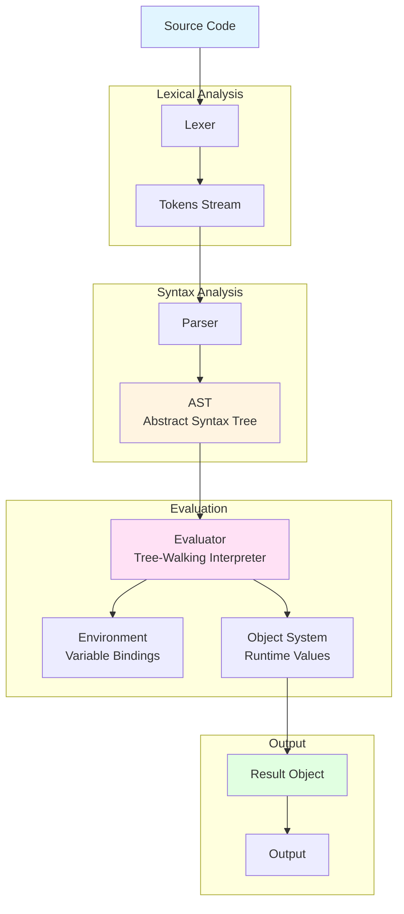
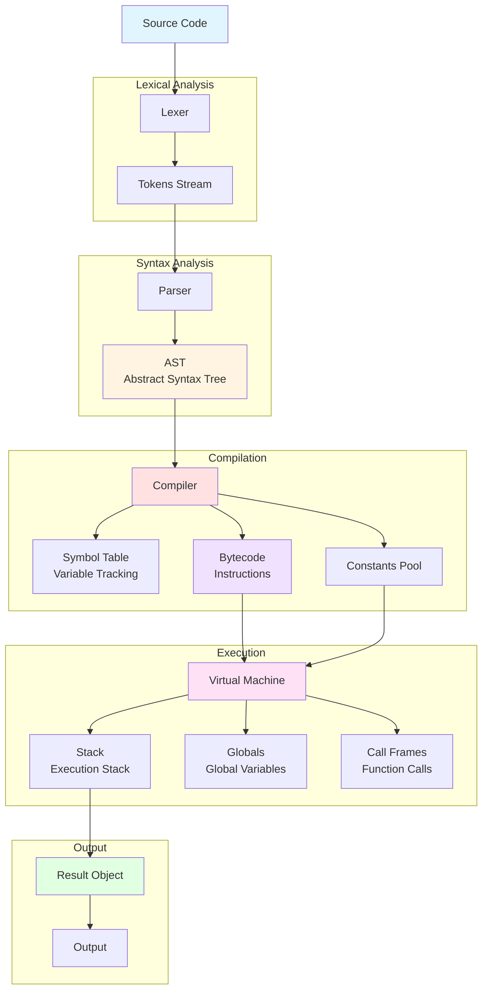

# Monkey Language Execution Flows

## 1. Tree-Walking Interpreter Flow

### Flow Details:

1. **Source Code** → Raw Monkey language code
2. **Lexer** (`lexer/lexer.go`) → Tokenizes input character by character
3. **Tokens** → Stream of tokens (INT, IDENT, PLUS, etc.)
4. **Parser** (`parser/parser.go`) → Builds AST using recursive descent parsing
5. **AST** (`ast/ast.go`) → Tree structure representing program semantics
6. **Evaluator** (`evaluator/evaluator.go`) → Walks AST nodes and evaluates them directly
7. **Environment** → Stores variable and function bindings during execution
8. **Object System** (`object/object.go`) → Runtime value representation (Integer, String, Function, etc.)
9. **Result** → Final evaluated object
10. **Output** → Displayed to user

**Characteristics:**
- Simple and intuitive
- Slower execution (re-evaluates AST each time)
- Direct AST interpretation
- Good for debugging and learning

---

## 2. Compiler + Virtual Machine Flow

### Flow Details:

1. **Source Code** → Raw Monkey language code
2. **Lexer** (`lexer/lexer.go`) → Tokenizes input (same as interpreter)
3. **Tokens** → Stream of tokens (same as interpreter)
4. **Parser** (`parser/parser.go`) → Builds AST (same as interpreter)
5. **AST** (`ast/ast.go`) → Tree structure (same as interpreter)
6. **Compiler** (`compiler/compiler.go`) → Compiles AST to bytecode instructions
7. **Symbol Table** (`compiler/symbol_table.go`) → Tracks symbols and their scopes
8. **Constants Pool** → Stores literal values (integers, strings, compiled functions)
9. **Bytecode** (`code/code.go`) → Array of VM instructions (OpConstant, OpAdd, OpPop, etc.)
10. **Virtual Machine** (`vm/vm.go`) → Stack-based VM that executes bytecode
11. **Stack** → Execution stack for operations and intermediate values
12. **Globals** → Array storing global variables
13. **Call Frames** (`vm/frame.go`) → Function call stack with instruction pointers
14. **Result** → Last popped stack element
15. **Output** → Displayed to user

**Characteristics:**
- More complex implementation
- Faster execution (bytecode is optimized)
- Separate compilation and execution phases
- Better for production use
- Used in the current REPL (`repl/repl.go`)

---

## Comparison

| Aspect | Interpreter | Compiler + VM |
|--------|-------------|---------------|
| **Execution** | Direct AST walking | Bytecode execution |
| **Speed** | Slower | Faster |
| **Complexity** | Simpler | More complex |
| **Memory** | Less overhead | Bytecode storage |
| **Use Case** | Learning, debugging | Production, performance |
| **Current Status** | Available in codebase | **Used by default** |

---

## Key Files by Component

### Shared Components
- `token/token.go` - Token definitions
- `lexer/lexer.go` - Lexical analyzer
- `parser/parser.go` - Syntax parser
- `ast/ast.go` - AST node definitions
- `object/object.go` - Object system

### Interpreter-Specific
- `evaluator/evaluator.go` - Tree-walking evaluator
- `evaluator/builtins.go` - Built-in functions

### Compiler+VM-Specific
- `compiler/compiler.go` - Bytecode compiler
- `compiler/symbol_table.go` - Symbol tracking
- `code/code.go` - Bytecode instruction definitions
- `vm/vm.go` - Virtual machine
- `vm/frame.go` - Call frame management

### Entry Points
- `main.go` - CLI REPL (uses Compiler+VM)
- `wasm/main.go` - WebAssembly version (uses Compiler+VM)
- `repl/repl.go` - REPL implementation (uses Compiler+VM)
